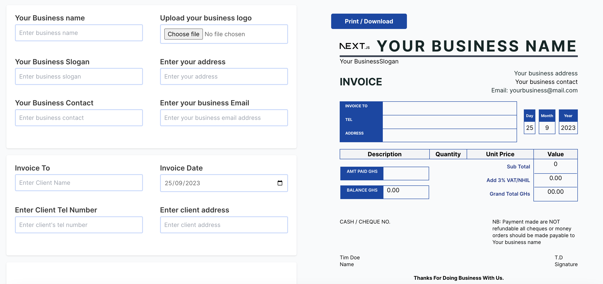

## Invoice App Assignment

This app that allows multiple companies to be able to input their company details and transactional details and generate invoices with their company details and logo on the invoice.

```bash
first install project dependecies using

npm install
# or
yarn add
# or
pnpm i

Then run project using

npm run dev
# or
yarn dev
# or
pnpm dev
# or
bun dev
```


